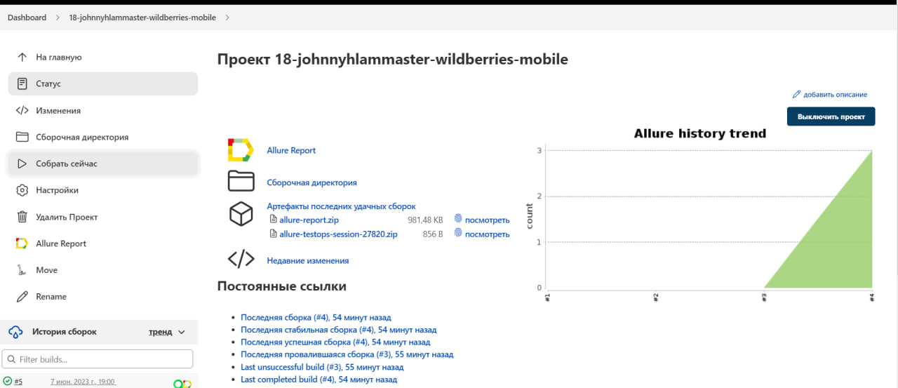
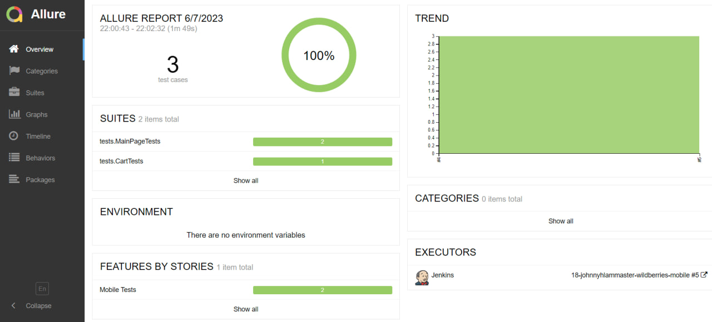
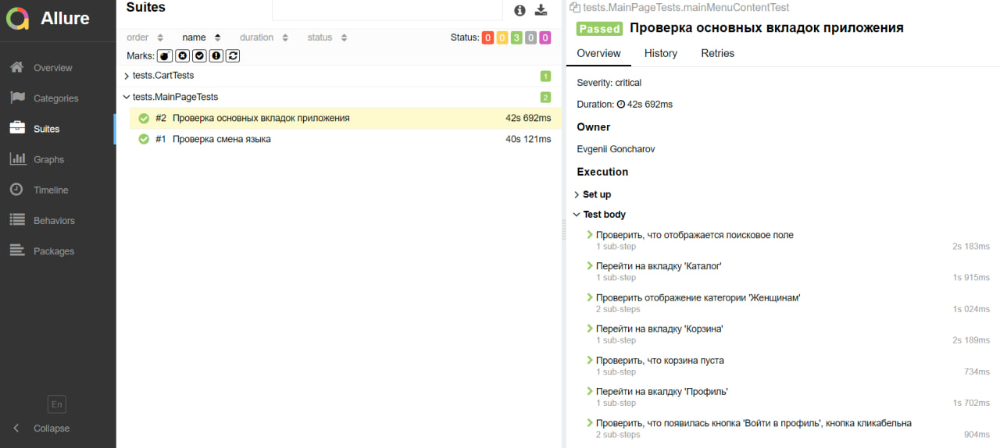
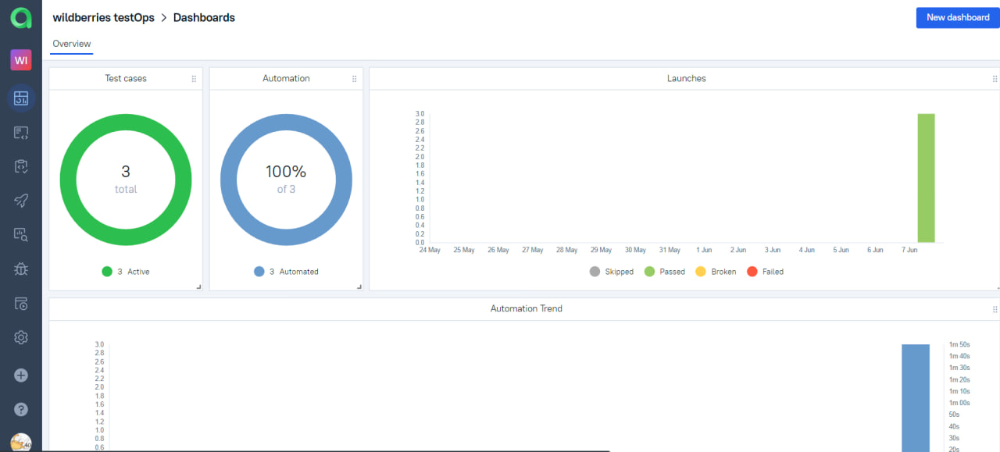
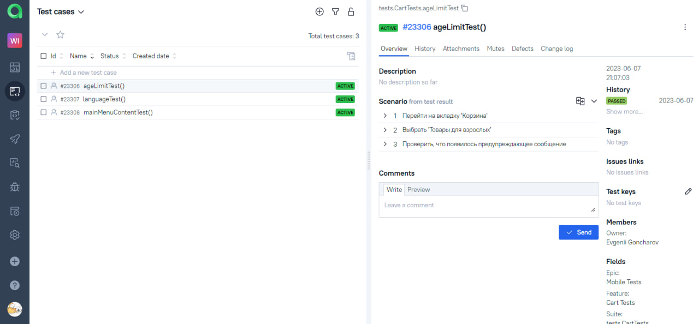
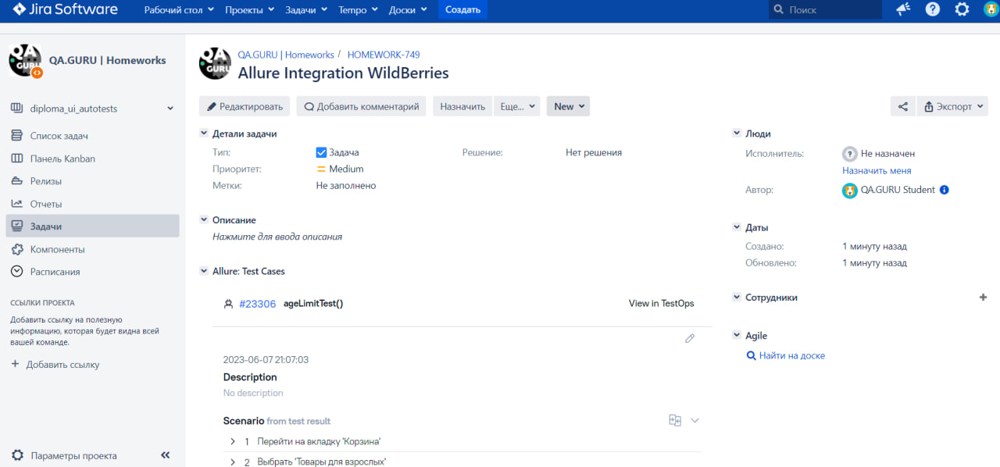
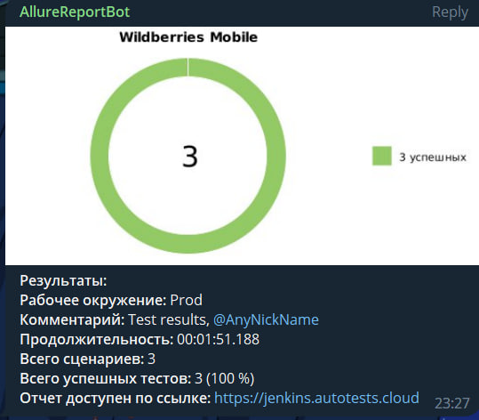

<h1 >Проект по мобильной автоматизации приложения Wildberries</h1>


## Содержание

* <a href="#tools">Технологии и инструменты</a>

* <a href="#cases">Реализованные проверки</a>

* <a href="#console">Запуск тестов из терминала</a>

* <a href="#jenkins">Запуск тестов в Jenkins</a>

* <a href="#allure">Allure Report отчеты</a>

* <a href="#allure-testops">Интеграция с Allure TestOps</a>

* <a href="#jira">Интеграция с Jira</a>

* <a href="#telegram">Telegram уведомления</a>

* <a href="#video">Пример видео прогона автотеста</a>

<a id="tools"></a>
## Технологии и инструменты

| Java                                                                                                    | IntelliJ Idea                                                                                                                | Android Studio                                                                                                                             | GitHub                                                                                                    | JUnit 5                                                                                                           | Gradle                                                                                                   | Selenide                                                                                                        |  Jenkins                                                                                                           | Jira                                                                                                                         |
|:--------------------------------------------------------------------------------------------------------|------------------------------------------------------------------------------------------------------------------------------|--------------------------------------------------------------------------------------------------------------------------------------------|-----------------------------------------------------------------------------------------------------------|-------------------------------------------------------------------------------------------------------------------|----------------------------------------------------------------------------------------------------------|-----------------------------------------------------------------------------------------------------------------|-------------------------------------------------------------------------------------------------------------------:|------------------------------------------------------------------------------------------------------------------------------|
| <a href="https://www.java.com/"></a> | <a id ="tech" href="https://www.jetbrains.com/idea/"></a> | <a href="https://developer.android.com/studio"></a> | <a href="https://github.com/"></a> | <a href="https://junit.org/junit5/"></a> | <a href="https://gradle.org/"></a> | <a href="https://selenide.org/"></a> |   <a href="https://www.jenkins.io/"></a> | <a href="https://www.atlassian.com/ru/software/jira"></a> |


| Browserstack                                                                                                                          | Appium                                                                                                    | Allure                                                                                                                    | Allure TestOps                                                                                                      |
|:--------------------------------------------------------------------------------------------------------------------------------------|-----------------------------------------------------------------------------------------------------------|---------------------------------------------------------------------------------------------------------------------------|---------------------------------------------------------------------------------------------------------------------|
| <a href="https://www.browserstack.com/"></a>       | <a href="https://appium.io/"></a> | <a href="https://github.com/allure-framework"></a> | <a href="https://qameta.io/"></a> |


<a id="cases"></a>
##  Реализованные проверки

-  Проверка навигации по главным страницам приложения
-  Смена валюты на главном экране
-  Проверка появления сообщения о возрастном ограничении

<a id="console"></a>
##  Запуск тестов из терминала
### Локальный запуск тестов

```
gradle clean test "-DdeviceHost=local"  
```

### Удаленный запуск тестов

```
gradle clean test "-DdeviceHost=browserstack" 
```

<a id="jenkins"></a>
## </a> Запуск тестов в [Jenkins](https://jenkins.autotests.cloud/job/18-johnnyhlammaster-wildberries-mobile/)

<p align="center">

<a href="https://jenkins.autotests.cloud/job/AD_demo_mobile_wb/"></a>

> Для запуска сборки необходимо нажать "Собрать сейчас". Клик по иконкам Allure TestOps и Allure Report позволяет перейти
> на просмотр страниц с тестовой документацией и отчетов.
</p>

<a id="allure"></a>
## </a> [Allure Report](https://jenkins.autotests.cloud/job/18-johnnyhlammaster-wildberries-mobile/7/allure/) отчеты

### Основное окно

<p align="center">

</p>

### Тесты

<p align="center">

</p>

<a id="allure-testops"></a>
## </a> Интеграция с [Allure TestOps](https://allure.autotests.cloud/project/3357/dashboards)

>Allure TestOps поддерживает подход Test cases as a code, что позволяет из кода поддерживать тестовую документацию в актуальном состоянии.

<p align="center">

</p>

<p align="center">

</p>

<a id="jira"></a>
## </a> Интеграция с [Jira](https://jira.autotests.cloud/browse/HOMEWORK-749)

<p align="center">

</p>

<a id="telegram"></a>
## </a> Telegram уведомления

<p >

</p>

<a id="video"></a>
## </a> Пример видео прогона автотеста

<p align="center">
  
</p>